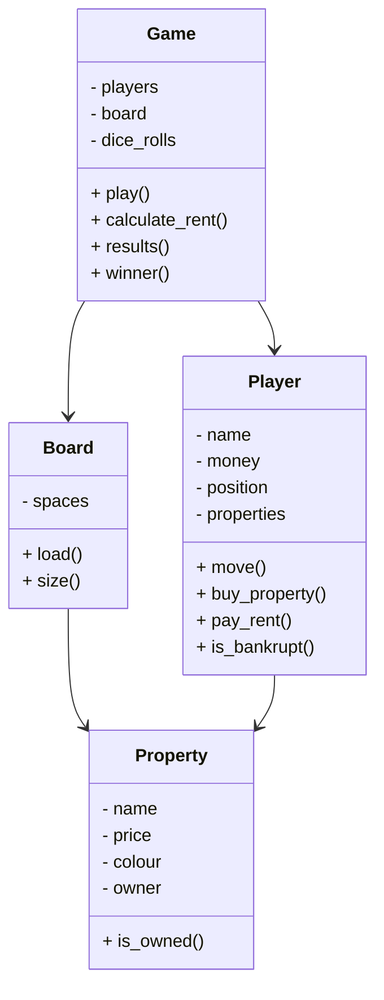

# Woven Monopoly – Deterministic Game Simulation

A Python implementation of the **Woven coding test** where a simplified Monopoly game is simulated using predefined dice rolls, making the game deterministic.

The application loads a board configuration and dice rolls from JSON files, simulates the game according to the rules, and outputs the final results including each player's money, position, and the winner.

---

# Game Rules

The game follows these simplified Monopoly rules:

- There are **four players** who take turns in the following order:
  - Peter
  - Billy
  - Charlotte
  - Sweedal

- Each player starts with **$16**
- All players start on **GO**

- When a player **passes GO**, they receive **$1**  
  *(excluding the starting position)*

- If a player lands on a **property**:
  - If unowned → the player **must buy it**
  - If owned → the player **must pay rent**

- If a player owns **all properties of the same colour**, rent is **doubled**

- The board **wraps around** after the last space

- The game does **not include**:
  - Chance cards
  - Jail
  - Stations

- The game ends when **a player becomes bankrupt**

- The player with the **most money remaining wins**

---

# Project Structure

```
woven-monopoly/
│
├── data/
│   ├── board.json
│   ├── rolls_1.json
│   └── rolls_2.json
│
├── src/
│   ├── board.py
│   ├── game.py
│   ├── player.py
│   └── property.py
│
├── tests/
│   └── test_game.py
│
├── app.py
├── main.py
├── requirements.txt
└── README.md
```

---

# System Design



---

# How the Simulation Works

1. The board is loaded from `data/board.json`
2. Dice rolls are loaded from `rolls_1.json` or `rolls_2.json`
3. Players move according to the dice rolls
4. Properties are purchased or rent is paid
5. The game continues until a player becomes bankrupt
6. The player with the most money remaining is declared the winner

---

# Running the Game (CLI)

Install dependencies:

```bash
pip install -r requirements.txt
```

Run the simulation:

```bash
python main.py
```

Example output:

```
Results for rolls_1.json

Peter       | Money: $12 | Position: 4
Billy       | Money: $10 | Position: 6
Charlotte   | Money: $14 | Position: 3
Sweedal     | Money: $9  | Position: 5

Winner: Charlotte
```

---

# Running the GUI (Streamlit)

This project also includes a **Streamlit GUI** to visualise the game.

Run the interface with:

```bash
streamlit run app.py
```

The GUI allows you to:

- Start the game simulation
- Roll dice using predefined roll sets
- View player turns
- Track player money and positions
- See the final winner

---

# Testing

Run the tests using **pytest**:

```bash
pytest
```

This verifies:

- Player movement
- Property purchasing
- Rent calculations
- Bankruptcy detection
- Correct winner determination

---

# Technologies Used

- Python
- JSON
- Streamlit
- Pytest
- Object-Oriented Programming

---

# Author

**Sohil Nagpal**

Software Engineer | IoT Systems | Machine Learning  
Melbourne, Australia  

GitHub:  
https://github.com/sohilnagpal04
