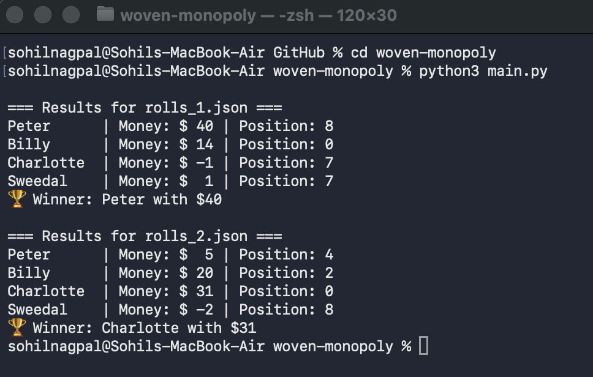
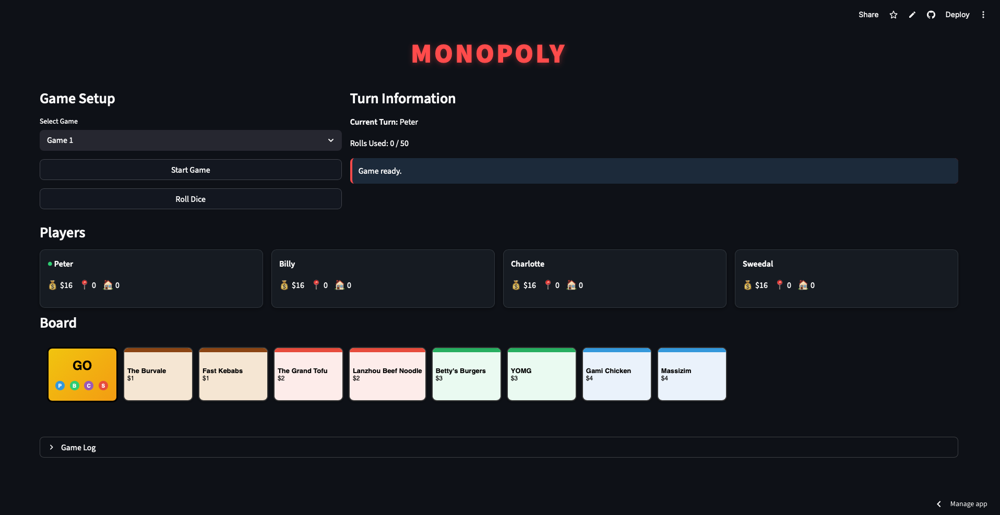

# 🎲 Woven Monopoly – Deterministic Game Simulation

This project implements the **Woven Coding Test**, a simplified Monopoly game where the dice rolls are predefined.

Since the dice rolls are known in advance, the game becomes **deterministic**, meaning the same input always produces the same result.

The game logic is implemented using **object-oriented Python**, and the project also includes a **Streamlit GUI** that visually demonstrates the simulation.

🔗 **Live Application**

https://sohilnagpal.streamlit.app

🎥 **Project Walkthrough Video**

https://youtu.be/RzK-e8VxAa8

---

# 🧠 How the Game Works

The simulation loads:

- a **board configuration** (`board.json`)
- a **set of dice rolls** (`rolls_1.json` or `rolls_2.json`)

The game engine simulates turns for all players and calculates:

- player movement
- property purchases
- rent payments
- player money balance
- final winner

---

# 🎮 Game Rules (Simplified)

- Four players take turns in this order:
  1. Peter
  2. Billy
  3. Charlotte
  4. Sweedal

- Each player starts with **$16** on **GO**
- Passing **GO** gives the player **$1**
- Landing on a property:
  - **Unowned → must buy**
  - **Owned → pay rent**
- Owning all properties of the same colour **doubles the rent**
- The board **wraps around** after the last space
- The game ends when **a player becomes bankrupt**
- The player with the **most money remaining wins**

---

# 📁 Project Structure

```bash
woven-monopoly/
│
├── .devcontainer/            # Development container configuration
│
├── data/                     # Game configuration files
│   ├── board.json
│   ├── rolls_1.json
│   └── rolls_2.json
│
├── images/                   # Screenshots used in README
│   ├── cli_output.png
│   └── gui_screenshot.png
│
├── src/                      # Core game logic
│   ├── board.py
│   ├── game.py
│   ├── player.py
│   └── property.py
│
├── tests/                    # Unit tests
│   └── test_game.py
│
├── app.py                    # Streamlit GUI
├── main.py                   # CLI simulation runner
│
├── requirements.txt
├── .gitignore
├── .gitattributes
└── README.md
```

---

# ⚙️ Installation

Clone the repository:

```bash
git clone https://github.com/sohilnagpal04/woven-monopoly.git
cd woven-monopoly
```

Install dependencies:

```bash
pip install -r requirements.txt
```

---

# ▶️ Run the Game (CLI)

Run the simulation from the command line:

```bash
python main.py
```

The program simulates the game using predefined dice roll files.

---

# 💻 CLI Output Example

The CLI simulation runs two roll sequences (`rolls_1.json` and `rolls_2.json`).



---

# 🖥️ Run the GUI (Streamlit)

Launch the graphical interface locally:

```bash
streamlit run app.py
```

The GUI allows you to:

- start the game simulation
- track player turns
- view player money and board positions
- see the final winner

---

# 🌐 Live Streamlit Demo

You can run the hosted application here:

🔗 https://sohilnagpal.streamlit.app

---

# 📸 GUI Preview

Example interface of the Streamlit GUI:



---

# 🧪 Testing

Run unit tests using **pytest**:

```bash
pytest
```

The tests verify:

- player movement
- property purchasing
- rent calculations
- bankruptcy detection
- correct winner determination

---

# 🛠 Technologies Used

- Python
- Streamlit
- Pytest
- JSON
- Object-Oriented Programming

---

# 👤 Author

**Sohil Nagpal**

Software Engineer  
Melbourne, Australia

Portfolio:  
https://sohilnagpal.com

GitHub:  
https://github.com/sohilnagpal04
